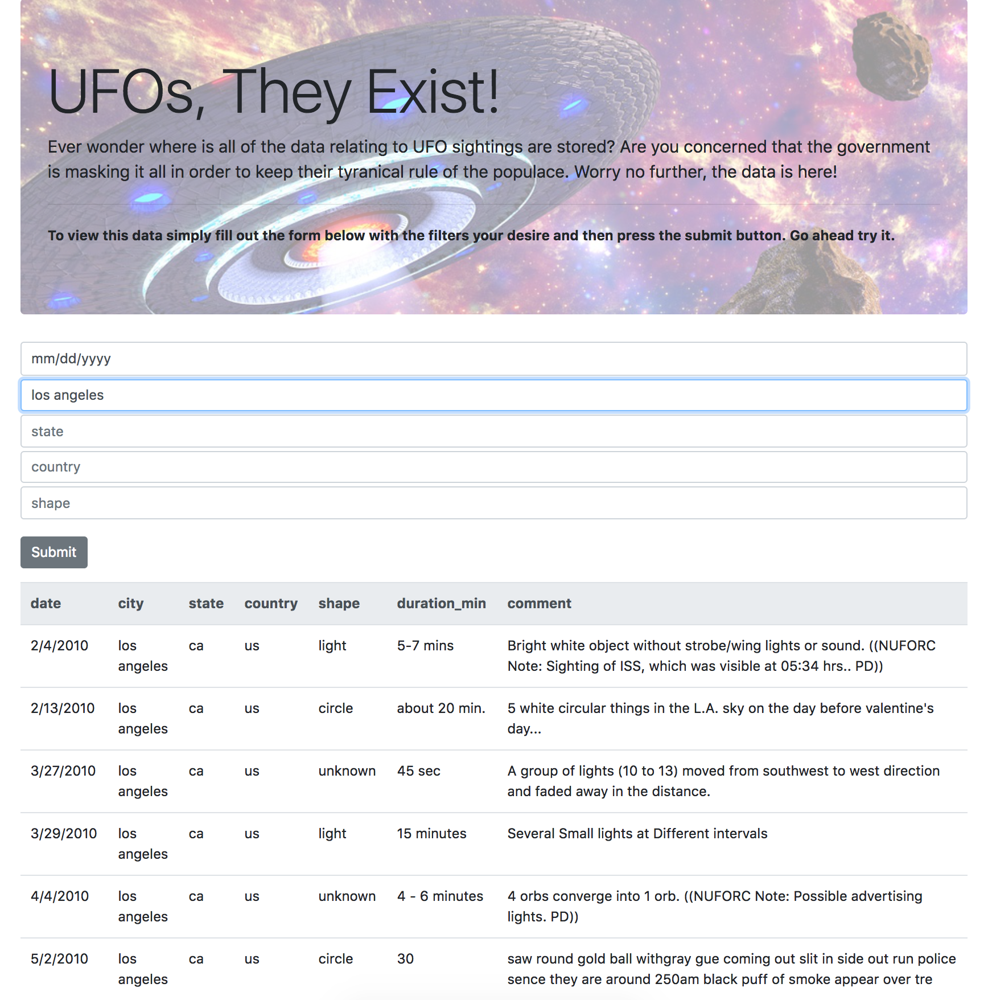

## UFO Sightings

# Background

WAKE UP SHEEPLE! The extra-terrestrial menace has come to Earth and we here at **www.ALIENS-R-REAL.com** have collected all of the eye-witness reports we could to prove it! All we need to do now is put this information online for the world to see and then the matter will finally be put to rest.

There is just one tiny problem though... Our collection is too large to search through manually. Even our most dedicated followers are complaining that they are having trouble locating specific reports in this mess.

That's why we are hiring you. We need you to write code that will create a table dynamically based upon a [dataset we provide](./htaccess/js/data/data.js). We also need to allow our users to search through the table for specific pieces of information. There's a catch though... We only use pure JavaScript, HTML, and CSS on our web pages. They are the only coding languages which can be trusted.

You can handle this... Right? The planet Earth needs to know what we have found!

# Objective - JavaScript and DOM Manipulation

### Level 1: Automatic Table and Date Search

* Create a basic HTML web page.

* Using the ufo dataset provided in the form of a JavaScript object, write code that appends a table to your web page and then adds new rows of data for each UFO sighting.

  * Make sure you have a column for `date/time`, `city`, `state`, `country`, `shape`, and `comment` at the very least.

* Add an `input` tag to your HTML document and write JavaScript code that will search through the `date/time` column to find rows that match user input.

### Level 2: Multiple Search Categories

* Complete all of Level 1 criteria.

* Using multiple `input` tags and/or select dropdowns, write JavaScript code so the user can to set multiple filters and search for UFO sightings using the following criteria based on the table columns:

  1. `date/time`
  2. `city`
  3. `state`
  4. `country`
  5. `shape`

### Level 3: Paginated Table

* Complete all of Level 2 criteria.

* Write code that will paginate the table (client-side pagination) and only display a maximum set number of results at a time (e.g. 50 results per page). Use Bootstrap's Pagination Components and write code to handle page changes and calculate the number of results which should appear on each page.
* These changes should happen in the DOM using JavaScript, therefore the user should never be directed to another web page as they paginate through the results.

- - -

### Dataset

* [UFO Sightings Data](./htaccess/js/data/data.js)

# Solution

## Sample Page

# [Click Here to test out the Live Page](./htaccess/)
